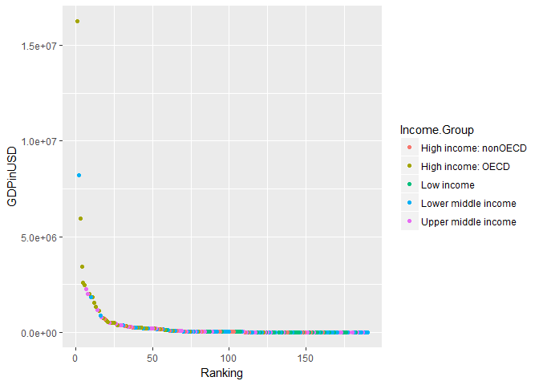

# Case Study 1
squazi  
March 21 2017  
#Introduction
###The following analyzes data that ranks the GDP of 190 countries with corresponding educational data for these countries.The intent is discover correlation/causation between financial success and education on an aggregate country level scale.

##Relevant Data
####The data files can be found at: https://d396qusza40orc.cloudfront.net/getdata%2Fdata%2FGDP.csv & https://d396qusza40orc.cloudfront.net/getdata%2Fdata%2FEDSTATS_Country.csv
####Header's are included in these comma seperated value files; however, similar variables between the data sets are not named synonymously. 

##Common abbreviaions:
####-GDP: Gross Domestic Product
####-Commonly understood abbreviations for countries: Can be referenced at http://www.worldatlas.com/aatlas/ctycodes.htm

##Pre-analyis
#####By viewing both tables, you can tell that there is an easily discernible unique variable between both tables, the trigram country code, however the dataset one dataset does not label it. This data also has a series of unnecssary blank columns that will need to be removed.
#####The other set of data has a wide variety of usable variables, but some of them are redundant.
#####I will work on tidying up the shorter set of data with the incorrect varables, trim extraneous data, merge it with the fuller set of data, then analyze.


```r
#Loading Packages: repmis, diplyr, tidyr, & ggplot2
library(repmis)
library(dplyr)
```

```
## Warning: package 'dplyr' was built under R version 3.3.3
```

```
## 
## Attaching package: 'dplyr'
```

```
## The following objects are masked from 'package:stats':
## 
##     filter, lag
```

```
## The following objects are masked from 'package:base':
## 
##     intersect, setdiff, setequal, union
```

```r
library(tidyr)
```

```
## Warning: package 'tidyr' was built under R version 3.3.3
```

```r
library(ggplot2)
#Setting working directory, downloading both data files, and reading them into R as CSV files with the names "Monies"" and "Brains"
setwd("C:/Users/esunqua/Documents/R/Case Study 1")
download.file("https://d396qusza40orc.cloudfront.net/getdata%2Fdata%2FGDP.csv",destfile="./GDP.csv")
list.files()
```

```
##  [1] "~$Code.docx"          "Case Study 1.Rmd"     "Case_Study_1.html"   
##  [4] "Case_Study_1.md"      "Case_Study_1.Rmd"     "Case_Study_1_files"  
##  [7] "Code.docx"            "EDU.csv"              "GDP.csv"             
## [10] "obs-casestudy1.RData"
```

```r
download.file("https://d396qusza40orc.cloudfront.net/getdata%2Fdata%2FEDSTATS_Country.csv",destfile="./EDU.csv")
list.files()
```

```
##  [1] "~$Code.docx"          "Case Study 1.Rmd"     "Case_Study_1.html"   
##  [4] "Case_Study_1.md"      "Case_Study_1.Rmd"     "Case_Study_1_files"  
##  [7] "Code.docx"            "EDU.csv"              "GDP.csv"             
## [10] "obs-casestudy1.RData"
```

```r
Monies <-read.csv("GDP.csv", header = TRUE)
head(Monies)
```

```
##     X Gross.domestic.product.2012 X.1           X.2          X.3 X.4 X.5
## 1                                  NA                                 NA
## 2                                  NA               (millions of      NA
## 3                         Ranking  NA       Economy  US dollars)      NA
## 4                                  NA                                 NA
## 5 USA                           1  NA United States  16,244,600       NA
## 6 CHN                           2  NA         China   8,227,103       NA
##   X.6 X.7 X.8
## 1  NA  NA  NA
## 2  NA  NA  NA
## 3  NA  NA  NA
## 4  NA  NA  NA
## 5  NA  NA  NA
## 6  NA  NA  NA
```

```r
#The first few observations are blank data and unspecific column names
Brains <-read.csv("EDU.csv", header = TRUE)
names(Brains)
```

```
##  [1] "CountryCode"                                      
##  [2] "Long.Name"                                        
##  [3] "Income.Group"                                     
##  [4] "Region"                                           
##  [5] "Lending.category"                                 
##  [6] "Other.groups"                                     
##  [7] "Currency.Unit"                                    
##  [8] "Latest.population.census"                         
##  [9] "Latest.household.survey"                          
## [10] "Special.Notes"                                    
## [11] "National.accounts.base.year"                      
## [12] "National.accounts.reference.year"                 
## [13] "System.of.National.Accounts"                      
## [14] "SNA.price.valuation"                              
## [15] "Alternative.conversion.factor"                    
## [16] "PPP.survey.year"                                  
## [17] "Balance.of.Payments.Manual.in.use"                
## [18] "External.debt.Reporting.status"                   
## [19] "System.of.trade"                                  
## [20] "Government.Accounting.concept"                    
## [21] "IMF.data.dissemination.standard"                  
## [22] "Source.of.most.recent.Income.and.expenditure.data"
## [23] "Vital.registration.complete"                      
## [24] "Latest.agricultural.census"                       
## [25] "Latest.industrial.data"                           
## [26] "Latest.trade.data"                                
## [27] "Latest.water.withdrawal.data"                     
## [28] "X2.alpha.code"                                    
## [29] "WB.2.code"                                        
## [30] "Table.Name"                                       
## [31] "Short.Name"
```

```r
#Country code is common unique variable between the data sets

#Removing blank rows and deleting unneccessary columns
GDP12 <-Monies[-c(1,2,3,4), ]
GDP12 <-subset(GDP12, select = -X.1)
GDP12 <-GDP12[1:4]
#Renaming GDP data, sorting data alphabetically, and deleting additional blank rows that floated up from the bottom of the sheet 
names(GDP12)<- c("CountryCode","Ranking","CountryName","GDPinUSD")
GDP12sort<-arrange(GDP12,CountryCode)
GDP12short <-GDP12sort[-c(1:98), ]
#Merging data by country code
mergeddata <-merge(x=GDP12short, y=Brains, by="CountryCode")
str(mergeddata, vec.len = 1, give.head = TRUE, give.length = 1, width = 1, list.len= 5)
```

```
## 'data.frame':	224 obs. of  34 variables:
##  $ CountryCode                                      : Factor w/ 229 levels "","ABW","ADO",..: 2 3 ...
##  $ Ranking                                          : Factor w/ 195 levels "",".. Not available.  ",..: 72 1 ...
##  $ CountryName                                      : Factor w/ 230 levels "","  East Asia & Pacific",..: 20 15 ...
##  $ GDPinUSD                                         : Factor w/ 207 levels ""," 1,008 "," 1,129 ",..: 65 192 ...
##  $ Long.Name                                        : Factor w/ 234 levels "American Samoa",..: 5 104 ...
##   [list output truncated]
```

```r
#Numeric variables like ranking and GDP are being represented as factors

#Removing data for countries that have no ranking or have na data for ranking
mergeddata <-arrange(mergeddata,Ranking)
mergedclean <-mergeddata[-c(1:35), ]
mergedclean2 <-subset(x=mergedclean,  !is.na(Ranking))
#Converting Variables Ranking and GDP into numeric, resorting and removing NA's that were introduced
mergedclean2$Ranking <-as.numeric(as.character(mergedclean2$Ranking))
mergedclean3 <-mergedclean2
mergedclean3$GDPinUSD <-gsub(",", "",mergedclean3$GDPinUSD)
mergedclean3$GDPinUSD <-as.numeric(as.character(mergedclean3$GDPinUSD))
mergedclean2 <-arrange(mergedclean3,GDPinUSD)
mergedclean2 <-subset(x=mergedclean2,  !is.na(Ranking))
```
#Critical Questions on Merged Data
###Question 1
#####How many ID's match between the two data sets?

```r
dim(mergeddata)
```

```
## [1] 224  34
```
#####224
######*The total number of observations; however, will have to be trimmed down to 190, as those are the countries we have rankings and GDP data for.

###Question 2
#####If the data is sorted in ascending order by GDP, what is the 13th country in the resulting data frame?

```r
print(mergedclean2[("13"), c("CountryCode", "Ranking", "CountryName")])
```

```
##    CountryCode Ranking         CountryName
## 13         KNA     178 St. Kitts and Nevis
```
#####St. Kitts and Nevis. 
#####This is an island country in the Carribean located in a chain of islands on the Lesser Antilles.
######It is known as the smalles sovereign state in the Western Hemisphere, both in population and area- yet it is 10 times the size of Tuvalu, the country with the lowest GDP on the list.

###Question 3
#####OECD Analysis
#####91.91304 is the mean of "High income: nonOECD" groups
#####32.96667 is the mean of "High income: OECD"
######Organisation for Economic Co-operation and Development ("OECD") is an intergovernmental coalition that promotes economic development. As there are only 35 countries as members, and the average ranking of these countries is approximately 32, it can be concluded that whatever economic strategies this organization is conducting are working as they triumph in GDP over their similar situated, high-income, counterparts.

###Question 4
####The distribution of GDP value of all countries, with color to indicate income groups
#####See graph below

```r
qplot(Ranking, GDPinUSD, data = mergedclean2, color = Income.Group)
```

<!-- -->

####Question 5
#####Summary Statistics for all 5 Income Groups


```
#High-Income & Non-OECD (dataframe reused from question 3)
summary(highOECD$GDPinUSD)
#High-Income & OECD (dataframe reused from question 3)
summary(highOECD2$GDPinUSD)
#Low-Income
low <-ifelse(mergedclean2$Income.Group == "Low income", mergedclean2$GDPinUSD, NA)
low <-low[!is.na(low)]
summary(low)
```
